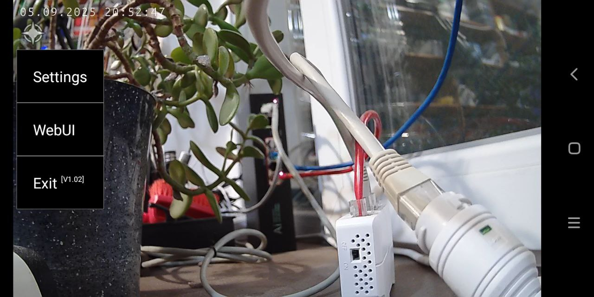

<picture>
  <source media="(prefers-color-scheme: dark)" srcset="https://openipc.org/assets/openipc-logo-white.svg">
  <source media="(prefers-color-scheme: light)" srcset="https://openipc.org/assets/openipc-logo-black.svg">
  
</picture>

## Decoder
**Miniature and universal H.264 and H.265 decoder for Android devices**

[][telegram]

### Introduction
The application is designed for OpenIPC devices and can be used for:
- Any testing and experiments
- Intercom systems
- Baby monitors
- Radio-controlled toys

The program is guaranteed to work on the fresh Android OS (8-16) and uses some GAPPS, so do not disable them !

_During the testing phase, the application is distributed only in binary form at the request of interested individuals and companies._




### Version history
- [v1.02, 2025.09.03](#)
    - Announcement and first public release
    - New compact and convenient menu
    - Audio (PCM, 8k) is now available when receiving RTSP over TCP/UDP
    - RTP UDP receiving is temporarily disabled
    - Experimental bluetooth button controller is temporarily disabled
    - The current size of the application is 23 kilobytes

### Statistics
**Please send information about devices where the program was tested only in this format:**
```
Manufacturer Model, Android Version, Kernel Version
```

### Verified devices
- Phone
    - Blackview BV4900Pro, Android 12, Kernel 4.19.191
    - Samsung Galaxy A51, Android 13, kernel 4.14.113
    - Samsung S8, Android 9, Kernel 4.4.153
    - Xiaomi Redmi 5A, Android 10, Kernel 4.9.261
    - Xiaomi Redmi Note 13 4G, Android 13, Kernel 5.15.94
- Tablet
    - Lenovo TB-X304L, Android 8.1.0, Kernel 3.18.71 (the image is cut off at the edges)
    - Lenovo TB-X606F, Android 10, Kernel unknown (the image is cut off at the edges)
    - Lenovo Tab P11, Android 11, Kernel 4.19.157-perf+ (the image is cut off at the edges)
- TV
    - Haier Candy Android TV 2K, Android 11, Kernel 4.9.243+ (no icon in apps on device)
    - SberBox SBDV-00001, Custom ?, Kernel 4.9.228
    - Smart TV X96Q, Android 10, kernel 4.9.170

### Incompatible devices
- Tablet
    - Pipo M6 Pro Android 4.4.2 Kernel 3.4.0 (Error parsing package)
    - Ployer Momo8, Android 4.1.1 ,Kernel 3.0.8+ (Error parsing package)
- TV
    - Eltex NV-501-Wac, Android 4.4.4, Kernel 3.10.24
    - TV box, Android 5.1.1, Kernel 3.14.29
    - Yandex TV, Android 7.1.1, Kernel 4.4.3 (wrong install)


[price]: https://openipc.org/support-open-source
[firmware]: https://github.com/openipc/firmware
[logo]: https://openipc.org/assets/openipc-logo-black.svg
[mit]: https://opensource.org/license/mit
[opencollective]: https://opencollective.com/openipc
[paypal]: https://www.paypal.com/donate/?hosted_button_id=C6F7UJLA58MBS
[project]: https://github.com/openipc
[telegram]: https://openipc.org/our-channels
[website]: https://openipc.org
[wiki]: https://github.com/openipc/wiki
