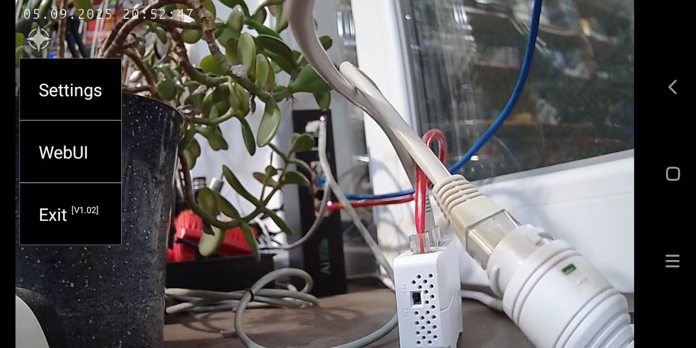

<picture>
  <source media="(prefers-color-scheme: dark)" srcset="https://openipc.org/assets/openipc-logo-white.svg">
  <source media="(prefers-color-scheme: light)" srcset="https://openipc.org/assets/openipc-logo-black.svg">
  
</picture>

# OpenIPC Decoder

[](https://github.com/OpenIPC/decoder/actions/workflows/build.yml)
[](LICENSE.md)
[](https://developer.android.com/about/versions/lollipop)
[](https://openipc.org/our-channels)

Android application for viewing RTSP streams from IP cameras with hardware-accelerated H.264/H.265 decoding.

<p align="center">
  
</p>

## Features

- **Video**: RTSP playback, H.264/H.265 hardware decoding via MediaCodec
- **Audio**: PCM, AAC (ADTS), G.711
- **Display modes**: Single camera, Carousel (auto-switch), Quad (4 cameras simultaneously)
- **Controls**: Pinch-to-zoom, pan, double-tap reset, Android TV remote (Leanback)
- **Network**: TCP/UDP, automatic reconnection with exponential backoff, Basic auth
- **WebUI**: Built-in browser for camera web interface access
- **Additional**: Screenshot capture, status/quality indicators, object pooling, 8 camera slots

## Requirements

- Android 5.0 (API 21) or higher
- IP camera with RTSP support

## Quick Start

1. Install the application on your Android device
2. Launch the application
3. Tap the screen to open the menu
4. Configure camera URL in the format:
   ```
   rtsp://username:password@ip_address:port/stream
   ```
5. Select transport (TCP/UDP)
6. Tap camera number to activate

## Building

```bash
cd android && ./gradlew assembleRelease
```

### Signing

Set environment variables for release signing:

```bash
export KEYSTORE_PASS=your_password
export KEY_ALIAS=your_alias
export KEY_PASS=your_key_password
```

## Settings

### Camera Menu

- **1-8** — camera slot selection
- **Settings** — advanced settings
- **Transport** — toggle between TCP/UDP
- **Carousel** — enable/disable carousel mode
- **Quad** — enable/disable quad mode
- **WebUI** — open camera web interface
- **Screenshot** — take screenshot
- **Exit** — exit application

### Carousel Mode

Automatic switching between selected cameras with configurable interval (3–120 seconds) and active camera indicator.

### Quad Mode

Simultaneous viewing of up to 4 cameras with individual settings per cell. TCP-only (UDP ports cannot be shared). Audio is disabled to reduce resource usage.

## Architecture

Multi-threaded processing on a fixed thread pool (5 threads): network I/O, watchdog, video decoding, audio playback, AAC decoding. Hardware video decoding via MediaCodec. Object pooling (`FramePool`) minimizes GC pressure. Quad mode creates dedicated per-cell pipelines (3 threads each).

## Security

- Credentials stripped from RTSP request URIs, sent only in `Authorization: Basic` header
- Resource cleanup on pause/stop: sockets closed, executor threads shut down, codecs stopped/released
- Global `UncaughtExceptionHandler` prevents silent crashes

## Device Compatibility

**Please send information about devices where the program was tested only in this format:**

```
Device type, Manufacturer and Model, Android Version, Kernel Version
```

### Verified Devices

- Phones
    - Asus ZC553KL, Android 8.1, Kernel 3.18.71
    - Blackview BV4900Pro, Android 12, Kernel 4.19.191
    - Oppo 5X, ColorOS 15.0, Kernel 5.15.149
    - Oppo A17, ColorOS 12.1, Kernel 4.19.191
    - Samsung Galaxy A51, Android 13, Kernel 4.14.113
    - Samsung Galaxy M21 (SM-M215F/DSN), Android 12, Kernel 4.14.113
    - Samsung Galaxy S25, Android 15, Kernel 6.6.30
    - Samsung A55 5G, Android 14, Kernel 6.1.93
    - Samsung Galaxy J7, Android 10, Kernel 3.18.150
    - Samsung S8, Android 9, Kernel 4.4.153
    - Samsung S23 Ultra, Android 15, Kernel 5.15.153
    - Xiaomi Redmi 7A, Android 10, Kernel 4.9.261
    - Xiaomi Redmi Note 7 (M1901F7G), Android 10, Kernel 4.4.192
    - Xiaomi Redmi Note 13 4G, Android 13, Kernel 5.15.94
- Tablets
    - Lenovo TB-X304L, Android 8.1.0, Kernel 3.18.71 (image cropped at edges)
    - Lenovo TB-X606F, Android 10, Kernel unknown (image cropped at edges)
    - Lenovo Tab P11, Android 11, Kernel 4.19.157-perf+ (image cropped at edges)
    - Samsung Galaxy Tab A, Android 7.1.1, Kernel 3.10.49
    - Samsung Galaxy Tab A, Android 11, Kernel 4.9.227
    - Samsung Tab A7 (SM-T505), Android 12, Kernel 4.19.157-perf-
- TVs and Set-top Boxes
    - A95X F3 AIR, Android 9, Kernel 4.9.113, SlimBOXtv AOSP 9.14 without GAPPS
    - IE X3 Air, Android 9, Kernel 4.9.113, SlimBOXtv AOSP 9.14 without GAPPS
    - Haier Candy Android TV 2K, Android 11, Kernel 4.9.243+ (no icon in device apps)
    - SberBox SBDV-00001, Custom ?, Kernel 4.9.228
    - TV Box X96Q, Android 10, Kernel 4.9.170 (original H313 SoC)
    - Yandex TV Novex NVX-55U169TSY, Android 7.1.1, Kernel 4.4.3
- Car Devices
    - Media Center JCAC10003, Android 12, Kernel 3.18.79+ (SoC ac8227/ac8229)
    - Mirror Z55, Android 8.1.0, Kernel 4.4.83

## GAPPS Compatibility Note

It has been noticed that the Decoder application may sometimes use some GAPPS components/libraries, so do not disable them or do it consciously. Research in this area is highly encouraged!

## Version History

<details>
<summary>Click to expand</summary>

#### 1.22 (Current)
- Fixed screenshot on Android 10+ via MediaStore API (API 29+)
- Added `onDestroy()` lifecycle cleanup
- Added Back key handling for Android TV (dismiss menu)
- Fixed AAC decode loop: replaced deprecated `getInputBuffers()`, release codec on error
- Added menu popup dismiss on Back key
- Removed misleading "Digest" auth claim from README
- Restructured project: Android source moved to `android/` subdirectory

#### 1.21
- Improved reconnection with exponential backoff
- Added AAC audio support
- Memory optimization with object pooling
- Removed trailing whitespace
- Updated documentation

#### 1.20
- Added status and quality indicators
- Screenshot functionality
- User interface improvements

#### 1.19
- Resource leak fixes
- Improved error handling
- Network stability

#### 1.0–1.18
- Basic playback functionality
- H.264/H.265 support
- Carousel and quad modes
- Gesture controls
- Android TV support

</details>

## License

[The Prosperity Public License 3.0.0](LICENSE.md). See [LICENSE.md](LICENSE.md) for details.

## Support

- Documentation: [openipc.org](https://openipc.org)
- Source code: [github.com/OpenIPC/decoder](https://github.com/OpenIPC/decoder)
- Questions and suggestions: via [GitHub Issues](https://github.com/OpenIPC/decoder/issues)
- Telegram: [OpenIPC Channels](https://openipc.org/our-channels)

[](https://openipc.org/our-channels)
